# PZ Console

**Your Project Zomboid server, in one control panel.**

A self-hosted dashboard for dedicated servers: manage B42 settings and Workshop mods,
keep an eye on players and resource usage, schedule backups, and handle restarts
without leaving your browser. Built with Python and plain HTML, CSS, and JavaScript.

[Quick start](#quick-start) · [Preview](#preview) · [Configuration guide](docs/config-editor.md) · [Documentation](#documentation) · [MIT license](LICENSE)

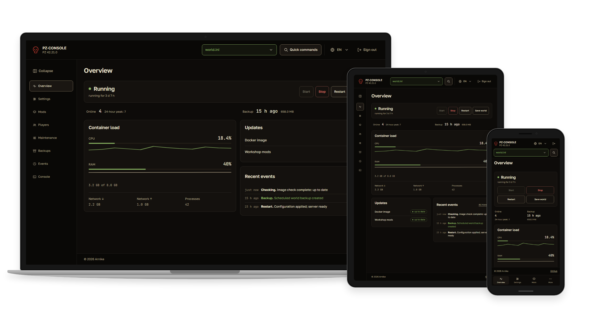

## Highlights

- **A clear view of your server.** Live status, CPU and memory charts, player counts,
  update checks, and recent activity over a shared server-sent event stream.
- **Settings you can review before applying.** INI and SandboxVars forms, source editors,
  saved drafts, masked diffs, revision checks, and configuration history.
- **Workshop management for B42.** Import items or collections, choose individual ModIDs,
  inspect dependencies, arrange load order and maps, and download packages before activation.
- **Backups that fit your routine.** Manual and daily backups, retention, archive verification,
  downloads, and a restore workflow with explicit confirmation.
- **Server operations with context.** Player warnings before restarts, image and mod update
  scheduling, an RCON watchdog, optional Telegram notifications, and an event journal.
- **At home on desktop, tablet, or phone.** Responsive navigation, quick commands with `Ctrl/Cmd+K`,
  English and Russian interfaces, and an installable PWA.
- **Self-contained UI assets.** Fonts, icons, scripts, and styles are served locally.
  Workshop, registry checks, and Telegram still need their upstream services.

## Preview

These are real Chromium captures of the application using isolated, fictional fixtures.
No production server, player records, credentials, or Workshop downloads are involved.
See [how to regenerate the screenshots](docs/screenshots/README.md).

### Overview

Check server status, resource usage, updates, and activity.

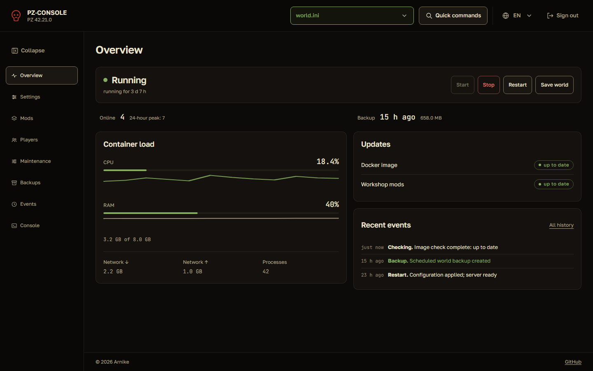

### Server settings

Edit a profile in forms or source view, save a draft, and review changes before writing files.

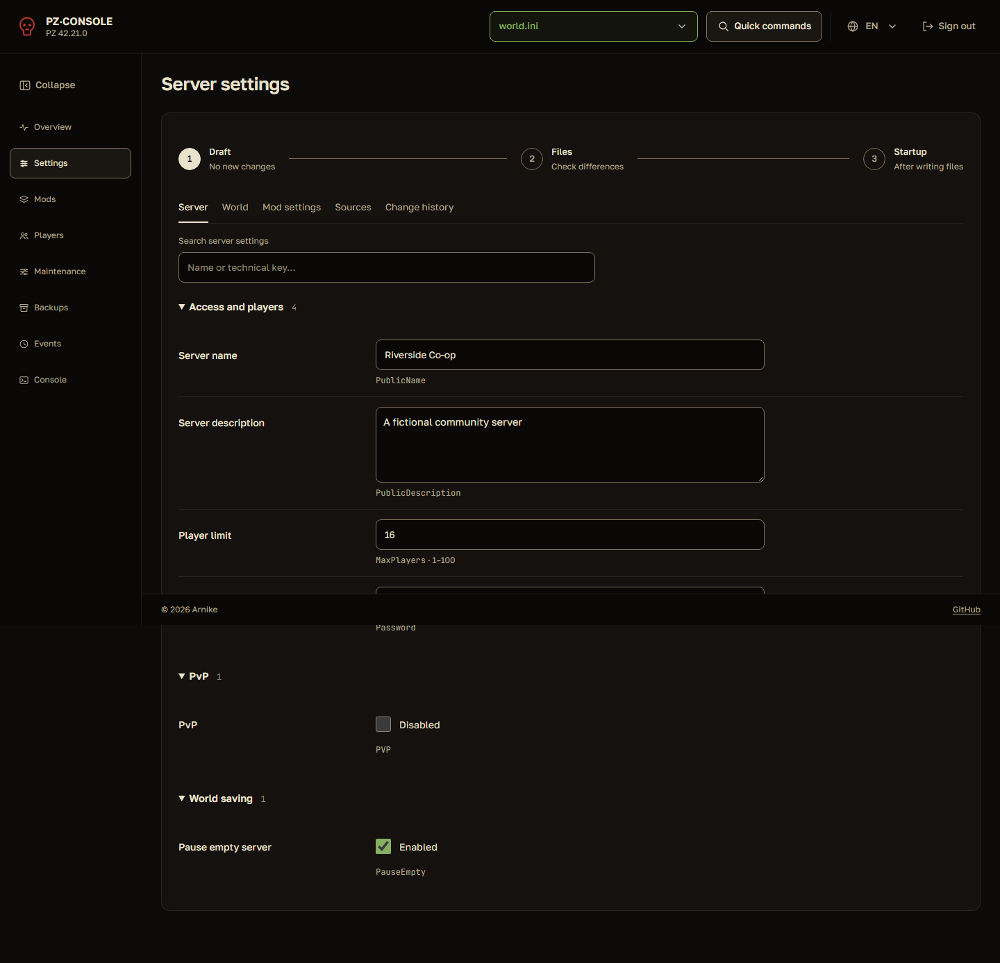

### Workshop mods

Keep Steam packages, individual ModIDs, dependencies, and load order in one workspace.

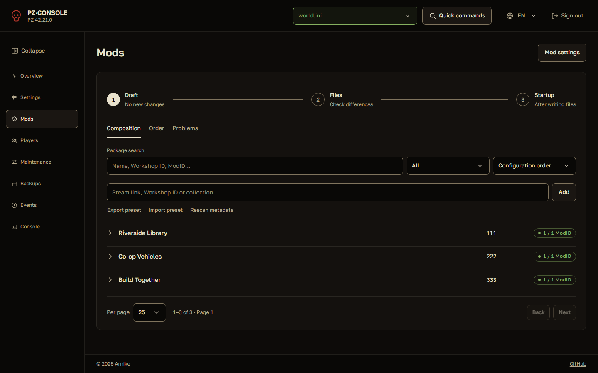

### Backups

Review scheduled backups, retained world archives, and the run journal.

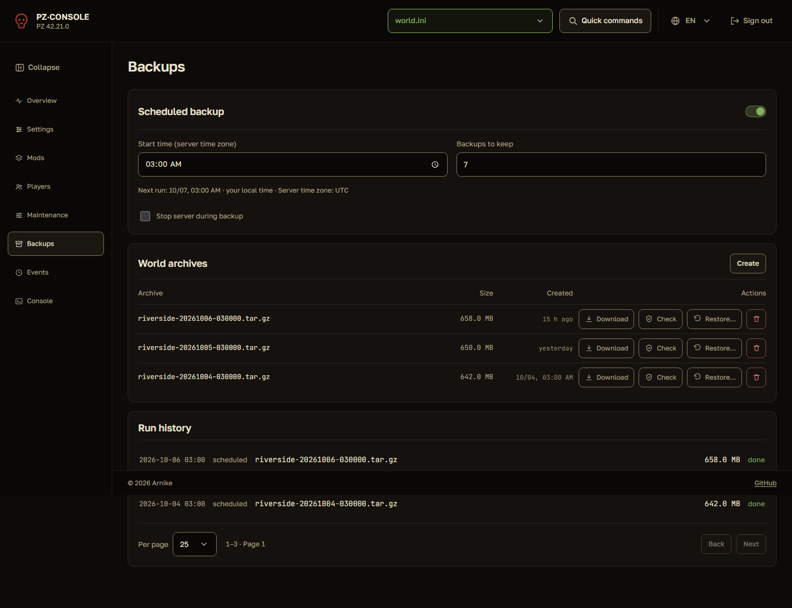

<details>
<summary>Players and mobile view</summary>

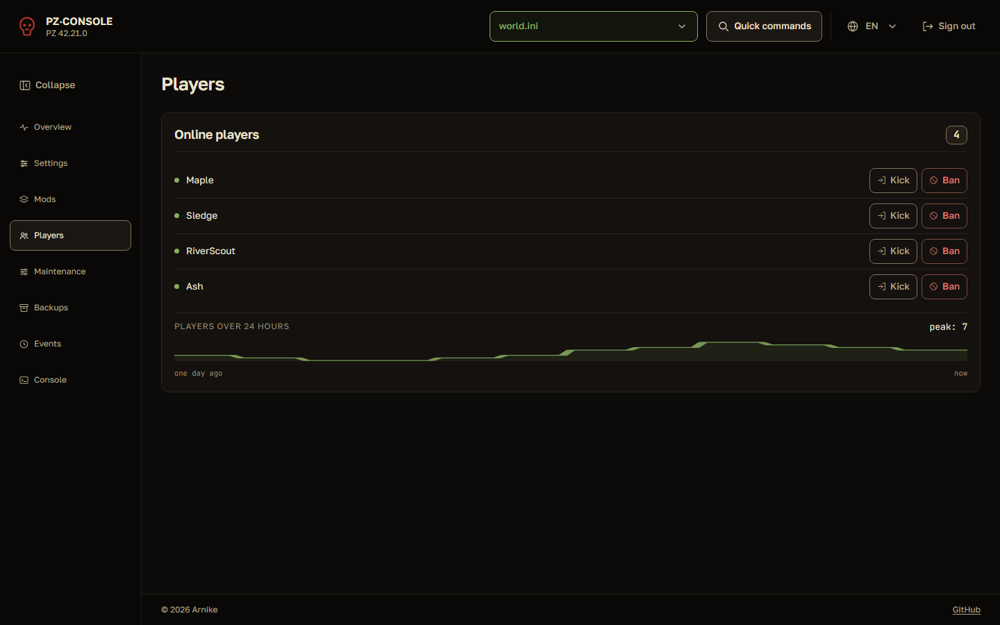

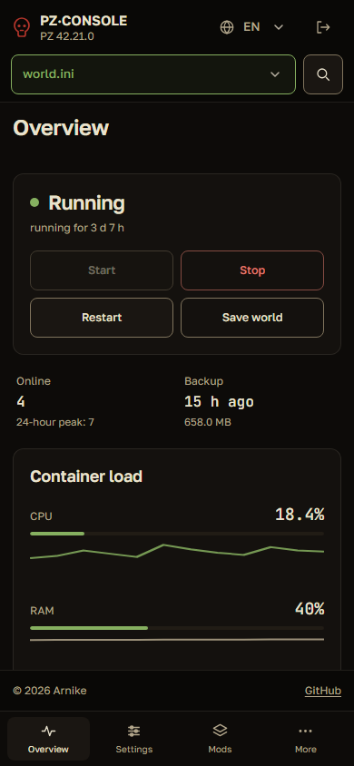

</details>

<details>
<summary>Laptop, tablet, and phone gallery</summary>

Each image combines real captures of the same workspace at three viewport sizes.
Device frames are drawn with CSS; no AI image generation is used.

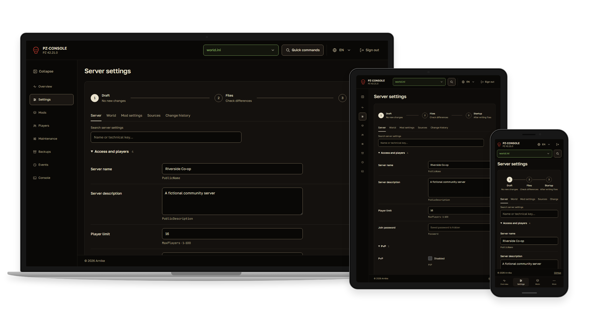

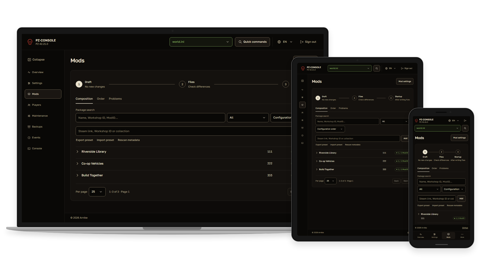

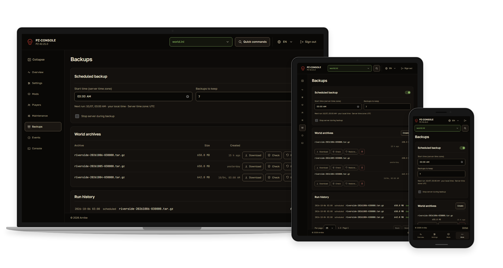

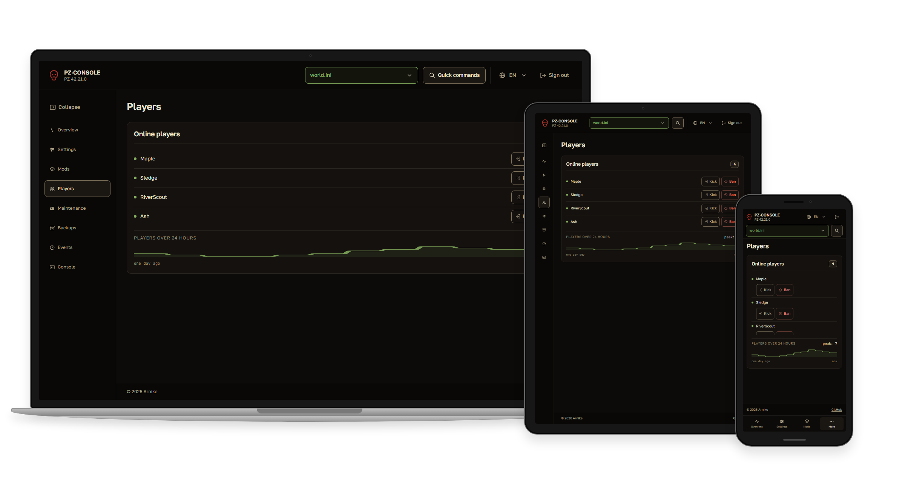

</details>

## Quick start

Use a Docker host with Docker Compose v2. The panel manages one dedicated server;
the B42 editors require access to that server's configuration and Workshop metadata.

### New server

1. Clone this repository and open its directory.
2. Copy the environment template:

   ```bash
   cp .env.example .env
   ```

   On PowerShell: `Copy-Item .env.example .env`.

3. Set `RCON_PASSWORD`, `ADMIN_PASSWORD`, `PZ_ADMIN_PASSWORD`, and `PZ_AUTH_KEY` in `.env`.
   The game administrator and the panel administrator are separate accounts.
   The panel password must contain at least 12 characters. Generate its encryption key with:

   ```bash
   python -c "import base64,secrets; print(base64.urlsafe_b64encode(secrets.token_bytes(32)).decode())"
   ```

4. Review `docker-compose.yml` and `.env`. The example uses
   [indifferentbroccoli's server image](https://github.com/indifferentbroccoli/projectzomboid-server-docker),
   separate volumes for game files and world data, and the `unstable` Steam branch for B42.
   Choose the branch, memory limit, timezone, and game ports for your host.
5. Build and start:

   ```bash
   docker compose up -d --build
   ```

Open **http://your-server:8081** and sign in with `PZ_ADMIN_LOGIN` and `PZ_ADMIN_PASSWORD`.
The first game server start downloads game files from Steam and can take time.

### Existing Docker Compose server

Keep your existing server definition. Add `dashboard/` and
`docker-compose.dashboard.yml` to its project directory, then merge the panel variables
from `.env.example` into your existing `.env`.

Adjust the overlay's RCON host, container/service names, image, Compose project name,
and data volume. The panel's `/data` must contain the **same world/configuration directory**
the game server uses. Point the external `pz-data` volume at your existing volume;
for a bind mount, replace `pz-data:/data` with your host directory.
Optionally mount game files at `/server-files:ro` for Workshop metadata.

```bash
docker compose -f docker-compose.yml -f docker-compose.dashboard.yml up -d --build
```

See the [installation guide](docs/installation.md) for authentication, HTTPS, volume mappings,
updates, and an RCON-only setup.

### Release images

GitHub releases publish the panel image to `ghcr.io/<owner>/<repository>:v1.0.0`
after code, browser, and Docker startup checks pass. Stable version tags also
update `:latest`; release notes provide an immutable image digest.
See [installing a released image](docs/installation.md#released-images-from-ghcr)
or [publishing a release with a `v*` tag](CONTRIBUTING.md#publish-a-github-release).

## Workspaces

| Workspace | What you can do |
| --- | --- |
| Overview | Check status, load, updates, recent events, and server controls |
| Settings | Edit INI and SandboxVars, review diffs, manage drafts and history |
| Mods | Resolve packages, select ModIDs, dependencies, load order, maps, and modpacks |
| Players | Inspect online players, view activity, kick or ban through RCON |
| Maintenance | Configure updates, watchdog recovery, and Telegram notifications |
| Backups | Schedule, create, verify, download, restore, and rotate world archives |
| Events | Filter the persistent server activity journal |
| Console | Send RCON commands and inspect/download container logs |

## Documentation

- [Installation and environment variables](docs/installation.md)
- [B42 configuration and Workshop workflow](docs/config-editor.md)
- [Backups, updates, watchdog, and API](docs/operations.md)
- [Development and quality checks](CONTRIBUTING.md)
- [Isolated B42 acceptance testing](docs/acceptance-b42.md)
- [Product scope](PRODUCT.md) and [design system](DESIGN.md)
- [Local fonts and licenses](dashboard/static/fonts/README.md)
- [Third party notices](THIRD_PARTY_NOTICES.md)

## Deployment boundaries

The Docker socket gives the panel control of the Docker host. Treat access to the panel
as administrator access; use a trusted network or an HTTPS reverse proxy and set
`PZ_AUTH_COOKIE_SECURE=true` for HTTPS. Keep RCON on the Compose network unless you
explicitly need remote access.

Panel responses and HTML pages prohibit search indexing, including the login page.
Preserve `X-Robots-Tag` through your proxy; see
[search visibility and private access](docs/installation.md#search-visibility).
An internet-accessible login page remains discoverable by network scanners; use a
VPN or network access restrictions when the entire panel must be private.

Authentication supports a single administrator from environment variables. Normal sessions
last up to 12 hours; “Remember me” retains a revocable session for 30 days. Persistent data,
including drafts, history, settings, and saved sessions, belongs in `dashboard-data`.
Offline PWA mode shows a reconnect page; server operations require a connection.

Automated checks use isolated fixtures. A separate B42 server acceptance run has covered
real startup, RCON, configuration verification, and Workshop workflows; in-game effects of
Sandbox changes remain outside that validation. See the [acceptance record](docs/acceptance-b42.md).

## License

[MIT](LICENSE) © 2026 Arnike. Bundled fonts and development tooling retain their
[upstream licenses](THIRD_PARTY_NOTICES.md). An independent community project for
Project Zomboid; not affiliated with The Indie Stone.
